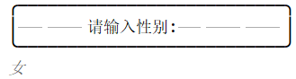

### 0 说明

** 注意：此版本是当时课程设计用来练手的。只是命令行版本。但是可以带你理解java操作数据库增删改查**

本项目已完成。欢迎大家fork和star。有问题请发邮件到jidaojiuyou@foxmail.com

使用步骤：

1.下载本项目的zip文件

2.解压用idea导入。或者自己重构项目

3.本项目只使用jdbc和java实现。mysql驱动(mysql-connector-java.jar)为8.0.21。如果你们导入为maven项目则会自动加载该驱动。如果是自己重构或者其他方式，请自己搜驱动并导入为库。

4.导入sql文件或自己创建数据库并导入数据。

5.修改数据库名称，用户名，密码

修改JdbcUtils.java中的sql连接地址，数据库账号，密码即可

```java
private static String url = "jdbc:mysql://localhost:3306/jdbc";//修改jdbc为你的库名,localhost为你的ip,3306为端口
private static String user = "root";//修改root为你的用户名
private static String pwd = "root";//修改root为你的密码
```
6.启动项目即可

---

## 以下为创建该项目的步骤和测试方式，可参考。（大bug没有，小bug自测）

---

### 1 数据库设计

#### 1.1 创建数据库(MySQL)

```mysql
create table student
(
    id int not null auto_increment primary key,
    sno varchar(20) not null,
    name varchar(20) not null,
    sex  varchar(20) not null,
    age int not null,
    grade int not null
);
```

#### 1.2 添加部分数据

```mysql
INSERT INTO `student`(`sno`, `name`, `sex`, `age`, `grade`) VALUES ('001', '张三', '男', 23, 1);
INSERT INTO `student`(`sno`, `name`, `sex`, `age`, `grade`) VALUES ('002', '李四', '女', 18, 2);
INSERT INTO `student`(`sno`, `name`, `sex`, `age`, `grade`) VALUES ('003', '王五', '女', 19, 2);
INSERT INTO `student`(`sno`, `name`, `sex`, `age`, `grade`) VALUES ('004', '陈六', '男', 20, 2);
INSERT INTO `student`(`sno`, `name`, `sex`, `age`, `grade`) VALUES ('005', '柳七', '男', 21, 3);
INSERT INTO `student`(`sno`, `name`, `sex`, `age`, `grade`) VALUES ('006', '杨八', '女', 22, 3);
```

info.sql文件包含了以上表和数据，直接导入自己的数据库也可以。

### 2 Java代码设计

#### 2.1 下载所需的驱动并加入库中(也可以用Maven导入)

#### 2.2 根据数据库创建pojo

```java
package com.jidaojiuyou.pojo;

/**
 * @author : jidaojiuyou
 * @version : 1.0
 * @date : 2020-08-08
 * @description : 学生实体类
 */
public class Student {
    private String sno;
    private String name;
    private String sex;
    private int age;
    private int grade;

    public Student() {
    }

    public String getSno() {
        return sno;
    }

    public void setSno(String sno) {
        this.sno = sno;
    }

    public String getName() {
        return name;
    }

    public void setName(String name) {
        this.name = name;
    }

    public String getSex() {
        return sex;
    }

    public void setSex(String sex) {
        this.sex = sex;
    }

    public int getAge() {
        return age;
    }

    public void setAge(int age) {
        this.age = age;
    }

    public int getGrade() {
        return grade;
    }

    public void setGrade(int grade) {
        this.grade = grade;
    }

    public Student(String sno, String name, String sex, int age, int grade) {
        this.sno = sno;
        this.name = name;
        this.sex = sex;
        this.age = age;
        this.grade = grade;
    }
}
```

#### 2.3 编写自己的InputUtils，以简化输入

```java
package com.jidaojiuyou.utils;

import java.util.Scanner;

/**
 * @author : jidaojiuyou
 * @version : 1.0
 * @date : 2020-08-08
 * @description : 简化输入
 */
public class InputUtils {
    static Scanner sc = new Scanner(System.in);

    public static int inputInt(){
        return sc.nextInt();
    }

    public static String inputString(){
        return sc.next();
    }

    public static void close(){
        sc.close();
    }
}
```

#### 2.4 编写自己的JdbcUtils，以简化创建连接和增删改查等操作

##### 2.4.1 创建JdbcUtils类

创建成员变量 driver、url、username、password。并使用静态代码块自动注册驱动

```java
package com.jidaojiuyou.utils;

import java.sql.*;

/**
 * @author : jidaojiuyou
 * @version : 1.1
 * @date : 2020-08-08
 * @description : 自定义数据库工具类
 */
public class JdbcUtils {
//    创建相关连接参数
    private static String driver = "com.mysql.jdbc.Driver";
    private static String url = "jdbc:mysql://localhost:3306/jdbc";
    private static String user = "root";
    private static String pwd = "root";

//    使用静态代码块类自动载入驱动
    static {
        try {
            Class.forName(driver);
        } catch (ClassNotFoundException e) {
            e.printStackTrace();
        }
    }

//    获取连接对象
//    增删改
//    查
//    释放资源
}
```

**<font color = red>注意：</font>**

- mysql和oracle的驱动不同，要使用对应的包。
- mysql和oracle的链接也不同，oracle的是实例(如orcl)，mysql的是库(如*Jdbc*库)
- 用户名和密码也不相同

##### 2.4.2 预先定义要使用的变量

```java
    private static Connection conn = null;
    private static Statement stat = null;
    private static ResultSet rs = null;
```

##### 2.4.3 编写获取连接对象的方法

```java
//    获取连接对象
    public static Connection getConnection() throws SQLException {
        conn = DriverManager.getConnection(url, user, pwd);
        return conn;
    }
```

##### 2.4.4 增删改

```java
//    增删改
    public static void update(String sql){
        try {
            conn = getConnection();
            stat = conn.createStatement();
            stat.executeUpdate(sql);
        } catch (SQLException throwables) {
            throwables.printStackTrace();
        }finally {
                close(stat,conn);
        }
    }
```

##### 2.4.5 查

```java
//    查
    public static List<Student> select(String sql){
        List<Student> list = new ArrayList<>();
        try {
            conn = getConnection();
            stat = conn.createStatement();
            rs = stat.executeQuery(sql);
            while (rs.next()){
                String sno = rs.getString("sno");
                String name = rs.getString("name");
                String sex = rs.getString("sex");
                int age = rs.getInt("age");
                int grade = rs.getInt("grade");
               list.add(new Student(sno,name,sex,age,grade));
            }
        } catch (SQLException throwables) {
            throwables.printStackTrace();
        }finally {
            close(stat,conn,rs);
        }
        return list;
    }
```

##### 2.4.6 释放资源

```java
    private static void close(Statement stat,Connection conn) {
        try {
            if(stat != null) {
                stat.close();
            }
        } catch (SQLException e) {
            e.printStackTrace();
        }

        try {
            if(conn != null) {
                conn.close();
            }
        } catch (SQLException e) {
            e.printStackTrace();
        }
    }

    private static void close(Statement stat,Connection conn,ResultSet rs) {
        try {
            if(rs != null) {
                rs.close();
            }
        } catch (SQLException e) {
            e.printStackTrace();
        }
        close(stat,conn);
    }
```

#### 2.5 创建StudentDao接口

```mysql
package com.jidaojiuyou.dao;

import com.jidaojiuyou.pojo.Student;

import java.util.List;

/**
 * @author : jidaojiuyou
 * @version : 1.0
 * @date : 2020-08-08
 * @description : studentDao的接口
 */
public interface StudentDao {
    /**
     * 查询信息
     * @return List<Student> 学生集合
     */
    List<Student> selectAll();

    /**
     * 查询一条信息
     * @param sno 学号
     * @return Student 学生类
     */
    Student selectById(String sno);

    /**
     * 增加信息
     * @param student 学生类
     */
    void insert(Student student);

    /**
     * 修改信息
     * @param student 学生类
     */
    void update(Student student);

    /**
     * 删除信息
     * @param sno 学号
     */
    void delete(String sno);
}
```

#### 2.6 实现接口

```java
package com.jidaojiuyou.dao.impl;

import com.jidaojiuyou.dao.StudentDao;
import com.jidaojiuyou.pojo.Student;
import com.jidaojiuyou.utils.JdbcUtils;

import java.util.List;

/**
 * @author : jidaojiuyou
 * @version : 1.0
 * @date : 2020-08-08
 * @description : 实现studentDao
 */
public class StudentDaoImpl implements StudentDao {

    /**
     * 查询信息
     * @return List<Student> 学生集合
     */
    @Override
    public List<Student> selectAll() {
        String sql = "Select sno,name,sex,age,grade from student";
        return JdbcUtils.select(sql);
    }

    /**
     * 查询一条信息
     * @param sno 学号
     * @return Student 学生类
     */
    @Override
    public Student selectById(String sno) throws IndexOutOfBoundsException {
        String sql = "Select sno,name,sex,age,grade from student where sno = '"+sno+"'";
        return JdbcUtils.select(sql).get(0);
    }

    /**
     * 增加信息
     * @param student 学生类
     */
    @Override
    public void insert(Student student) {
        String sno = student.getSno();
        String name = student.getName();
        String sex = student.getSex();
        int age = student.getAge();
        int grade = student.getGrade();
        String sql = "insert into student(sno,name,sex,age,grade) values('"+sno+"','"+name+"','"+sex+"','"+age+"','"+grade+"')";
        JdbcUtils.update(sql);
    }

    /**
     * 修改信息
     * @param student 学生类
     */
    @Override
    public void update(Student student) {
        String sno = student.getSno();
        String name = student.getName();
        String sex = student.getSex();
        int age = student.getAge();
        int grade = student.getGrade();
        String sql = "update student set sno = '"+sno+"',name = '"+name+"',sex = '"+sex+"',age = '"+age+"',grade = '"+grade+"' where sno = '"+sno+"'";
        JdbcUtils.update(sql);
    }

    /**
     * 删除信息
     * @param sno 学号
     */
    @Override
    public void delete(String sno) {
        String sql = "delete from student where sno = '"+sno+"'";
        JdbcUtils.update(sql);
    }
}
```

#### 2.7 Main方法

```java
package com.jidaojiuyou.main;

import com.jidaojiuyou.utils.InputUtils;
import com.jidaojiuyou.utils.JdbcUtils;

/**
 * @author : jidaojiuyou
 * @version : 1.2
 * @date : 2020-08-09
 */
public class Main {
    public static void main(String[] args) {
        menu();
    }

    public static void menu() {
        while (true) {
            System.out.println("╭───────────────────────────╮");
            System.out.println("│\t\t\t\t\t\t\t│");
            System.out.println("│\t欢迎使用学生信息管理系统\t│");
            System.out.println("│\t\t\t\t\t\t\t│");
            System.out.println("│\t\t1、添加学生信息\t\t│");
            System.out.println("│\t\t2、修改学生信息\t\t│");
            System.out.println("│\t\t3、查询学生信息\t\t│");
            System.out.println("│\t\t4、删除学生信息\t\t│");
            System.out.println("│\t\t5、退出\t\t\t\t│");
            System.out.println("│\t\t请输入你的选择:\t\t│");
            System.out.println("╰───────────────────────────╯");

            int choice = InputUtils.inputInt();
            switch(choice){
                case 1: Menu.insert();break;
                case 2: Menu.update();break;
                case 3: Menu.query();break;
                case 4: Menu.delete();break;
                case 5: exit();break;
                default:{
                    System.out.println("╭───────────────────────────╮");
                    System.out.println("│\t你的输入有误，请重新输入!\t│");
                    System.out.println("╰───────────────────────────╯");
                    System.out.println();
                    break;
                }
            }
        }
    }
    public static void exit(){

        System.out.println("╭───────────────────────────╮");
        System.out.println("│\t\t你已经退出系统！\t\t│");
        System.out.println("╰───────────────────────────╯");
        InputUtils.close();
        System.exit(-1);
    }
}
```

#### 2.8 Menu

```java
package com.jidaojiuyou.main;

import com.jidaojiuyou.dao.StudentDao;
import com.jidaojiuyou.dao.impl.StudentDaoImpl;
import com.jidaojiuyou.pojo.Student;
import com.jidaojiuyou.utils.InputUtils;

import java.util.List;

/**
 * @author : jidaojiuyou
 * @version : 1.0
 * @date : 2020-08-09
 * @description : 菜单类
 */
public class Menu {
    static StudentDao dao = new StudentDaoImpl();

    /**
     * 查询信息
     */
    public static void query(){
        System.out.println("╭───────────────────────────╮");
        System.out.println("│\t\t正在查询学生信息\t\t│");
        System.out.println("╰───────────────────────────╯");
        while(true){
            List<Student> list = dao.selectAll();
            System.out.println("╭───────────────────────────╮");
            System.out.printf("│%4s\t%4s\t%s\t%s\t%s\t│\n","学号","姓名","性别","年龄","年级");
///            System.out.println("│\t学号\t姓名\t\t性别\t年龄\t年级\t│");
            System.out.println("├───────────────────────────┤");
            for (Student stu : list) {
                System.out.printf("│%4s\t%4s\t%s\t%3d\t%2d\t│\n",stu.getSno(),stu.getName(),stu.getSex(),stu.getAge(),stu.getGrade());
            }
            System.out.println("╰───────────────────────────╯");
            System.out.println();
            System.out.println("╭───────────────────────────╮");
            System.out.println("│\t\t请输入0返回上一级\t\t│");
            System.out.println("╰───────────────────────────╯");
            int i = InputUtils.inputInt();
            if(i == 0){
                Main.menu();
                return;
            }
        }
    }

    /**
     * 添加学生
     */
    public static void insert(){
        while (true) {
            System.out.println("╭───────────────────────────╮");
            System.out.println("│\t\t正在准备添加学生信息\t│");
            System.out.println("╰───────────────────────────╯");
            System.out.println();
            System.out.println("╭───────────────────────────╮");
            System.out.println("│\t\t请输入学号:\t\t\t│");
            System.out.println("╰───────────────────────────╯");
            String sno = InputUtils.inputString();
            System.out.println("╭───────────────────────────╮");
            System.out.println("│\t\t请输入姓名:\t\t\t│");
            System.out.println("╰───────────────────────────╯");
            String name = InputUtils.inputString();
            System.out.println("╭───────────────────────────╮");
            System.out.println("│\t\t请输入性别:\t\t\t│");
            System.out.println("╰───────────────────────────╯");
            String sex = InputUtils.inputString();
            System.out.println("╭───────────────────────────╮");
            System.out.println("│\t\t请输入年龄:\t\t\t│");
            System.out.println("╰───────────────────────────╯");
            int age = InputUtils.inputInt();
            System.out.println("╭───────────────────────────╮");
            System.out.println("│\t\t请输入年级:\t\t\t│");
            System.out.println("╰───────────────────────────╯");
            int grade = InputUtils.inputInt();
            Student student = new Student(sno, name, sex, age, grade);
            dao.insert(student);
            System.out.println("╭───────────────────────────╮");
            System.out.println("│\t\t学生添加完成！\t\t\t│");
            System.out.println("╰───────────────────────────╯");
            System.out.println("╭───────────────────────────╮");
            System.out.println("│\t\t请输入0返回上一级\t\t│");
            System.out.println("╰───────────────────────────╯");
            int i = InputUtils.inputInt();
            if(i == 0){
                Main.menu();
                return;
            }
        }
    }

    /**
     * 删除
     */
    public static void delete(){
        while(true){
            System.out.println("╭───────────────────────────╮");
            System.out.println("│\t\t正在准备删除学生信息\t│");
            System.out.println("╰───────────────────────────╯");
            System.out.println("╭───────────────────────────╮");
            System.out.println("│\t\t请输入学生学号：\t\t│");
            System.out.println("│\t\t输入0将返回上一级\t\t│");
            System.out.println("╰───────────────────────────╯");
            String sno = InputUtils.inputString();
            if(0 == Integer.parseInt(sno)){
                Main.menu();
                return;
            }
            Student stu;

            try {
                stu = dao.selectById(sno);
            }catch (Exception e) {
                System.out.println("╭───────────────────────────╮");
                System.out.println("│\t\t学号输入有误！\t\t\t│");
                System.out.println("╰───────────────────────────╯");
                continue;
            }
            System.out.println("╭───────────────────────────╮");
            System.out.printf("│%4s\t%4s\t%s\t%s\t%s\t│\n","学号","姓名","性别","年龄","年级");
            System.out.println("├───────────────────────────┤");
            System.out.printf("│%4s\t%4s\t%s\t%3d\t%2d\t│\n",stu.getSno(),stu.getName(),stu.getSex(),stu.getAge(),stu.getGrade());
            System.out.println("╰───────────────────────────╯");
            System.out.println();
            System.out.println("╭───────────────────────────╮");
            System.out.println("│\t\t确认删除(Y/N)?\t\t│");
            System.out.println("╰───────────────────────────╯");
            String choice = InputUtils.inputString();
            if ("Y".equals(choice)||"y".equals(choice)){
                dao.delete(sno);
                System.out.println("╭───────────────────────────╮");
                System.out.println("│\t\t学生删除完成！\t\t\t│");
                System.out.println("╰───────────────────────────╯");
            }
        }
    }

    /**
     * 修改学生信息
     */

    public static void update(){
        while(true) {
            System.out.println("╭───────────────────────────╮");
            System.out.println("│\t\t正在准备修改学生信息\t│");
            System.out.println("╰───────────────────────────╯");
            System.out.println("╭───────────────────────────╮");
            System.out.println("│\t\t请输入学生学号：\t\t│");
            System.out.println("│\t\t输入0将返回上一级\t\t│");
            System.out.println("╰───────────────────────────╯");
            String sno = InputUtils.inputString();
            if (0 == Integer.parseInt(sno)) {
                Main.menu();
                return;
            }
            Student stu;

            try {
                stu = dao.selectById(sno);
            } catch (Exception e) {
                System.out.println("╭───────────────────────────╮");
                System.out.println("│\t\t学号输入有误！\t\t\t│");
                System.out.println("╰───────────────────────────╯");
                continue;
            }
            System.out.println("╭───────────────────────────╮");
            System.out.printf("│%4s\t%4s\t%s\t%s\t%s\t│\n", "学号", "姓名", "性别", "年龄", "年级");
            System.out.println("├───────────────────────────┤");
            System.out.printf("│%4s\t%4s\t%s\t%3d\t%2d\t│\n", stu.getSno(), stu.getName(), stu.getSex(), stu.getAge(), stu.getGrade());
            System.out.println("╰───────────────────────────╯");
            System.out.println();
            System.out.println("╭───────────────────────────╮");
            System.out.println("│\t\t请输入修改字段：\t\t│");
            System.out.println("│\t\t输入0将返回上一级\t\t│");
            System.out.println("╰───────────────────────────╯");
            String column = InputUtils.inputString();
            switch (column){
                case "0": {
                    Main.menu();
                    return;
                }
                case "学号": {
                    System.out.println("╭───────────────────────────╮");
                    System.out.println("│\t\t学号不支持修改!\t\t│");
                    System.out.println("╰───────────────────────────╯");
                    break;
                }
                case "姓名": {
                    System.out.println("╭───────────────────────────╮");
                    System.out.println("│\t\t请输入新的姓名:\t\t│");
                    System.out.println("╰───────────────────────────╯");
                    String name = InputUtils.inputString();
                    stu.setName(name);
                    dao.update(stu);
                    System.out.println("╭───────────────────────────╮");
                    System.out.println("│\t\t学生修改完成！\t\t\t│");
                    System.out.println("╰───────────────────────────╯");
                    break;
                }
                case "性别": {
                    System.out.println("╭───────────────────────────╮");
                    System.out.println("│\t\t请输入新的性别:\t\t│");
                    System.out.println("╰───────────────────────────╯");
                    String sex = InputUtils.inputString();
                    stu.setSex(sex);
                    dao.update(stu);
                    System.out.println("╭───────────────────────────╮");
                    System.out.println("│\t\t学生修改完成！\t\t\t│");
                    System.out.println("╰───────────────────────────╯");
                    break;
                }
                case "年龄": {
                    System.out.println("╭───────────────────────────╮");
                    System.out.println("│\t\t请输入新的年龄:\t\t│");
                    System.out.println("╰───────────────────────────╯");
                    int age = InputUtils.inputInt();
                    stu.setAge(age);
                    dao.update(stu);
                    System.out.println("╭───────────────────────────╮");
                    System.out.println("│\t\t学生修改完成！\t\t\t│");
                    System.out.println("╰───────────────────────────╯");
                    break;
                }
                case "年级": {
                    System.out.println("╭───────────────────────────╮");
                    System.out.println("│\t\t请输入新的年级:\t\t│");
                    System.out.println("╰───────────────────────────╯");
                    int grade = InputUtils.inputInt();
                    stu.setGrade(grade);
                    dao.update(stu);
                    System.out.println("╭───────────────────────────╮");
                    System.out.println("│\t\t学生修改完成！\t\t\t│");
                    System.out.println("╰───────────────────────────╯");
                    break;
                }
                default:{
                    System.out.println("╭───────────────────────────╮");
                    System.out.println("│\t\t你的输入有误！\t\t│");
                    System.out.println("╰───────────────────────────╯");
                }
            }
        }
    }
}
```

### 3 功能测试

#### 3.1 菜单界面

<font color = red>~~开发环境设置显示制表符，所以打印界面显示横线~~</font>


#### 3.2 查询学生信息

输入3,可以正常显示查询结果


输入非0，则再次显示查询界面


输入0,返回主菜单


#### 3.3 添加学生信息


输入学号


输入姓名


输入性别



输入年龄


输入年级


添加完成


输入其他数值，继续添加学生


输入0返回上级


查询添加的那两条数据

输入3


#### 3.4 删除学生信息

主菜单界面输入4


输入8


输入非Y值


返回删除学生界面

继续返回主界面进行查询是否真的没有删除数据


数据并未删除

继续进行删除操作


删除完成，反回查询是否删除成功


成功删除

#### 3.5 修改学生信息

主菜单界面输入2


输入学号 7

先查询学号为7的学生信息，显示查询结果


输入学号，则显示学号不支持修改


输入姓名或其他信息则修改成功


返回查询所有信息


已成功修改

#### 3.6 退出

主菜单输入5退出


